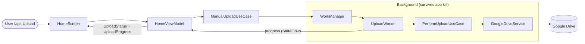
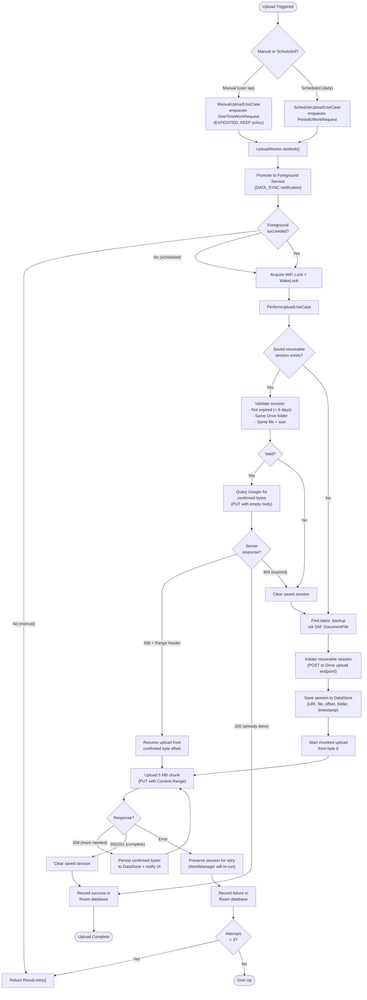
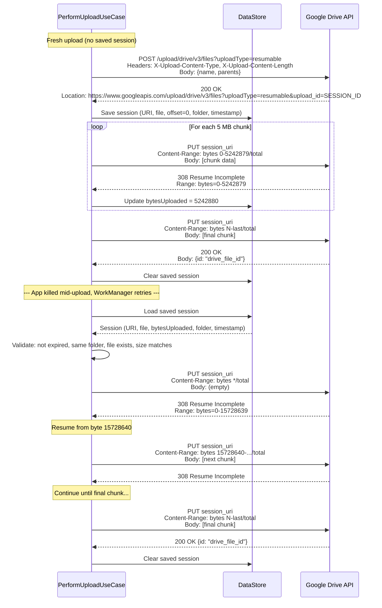

# Signal Backup

An Android app that automatically backs up Signal messenger backup files to Google Drive on a configurable daily schedule.

Signal produces local `.backup` files but does not provide built-in cloud backup. This app bridges that gap by monitoring a local folder for the latest backup file and uploading it to a Google Drive folder of your choice.

## Features

**Uploads**
- Manual one-tap upload from the home screen
- Scheduled daily uploads at a user-configured time via WorkManager
- Resumable uploads that survive app kills, process death, and device reboots -- the upload resumes from the last confirmed byte on the next attempt
- Chunked upload protocol (5 MB chunks) for resilience on mobile networks
- Real-time progress display with speed, percentage, and estimated time remaining
- Foreground service with notification showing upload progress
- WiFi lock and WakeLock to prevent network/CPU suspension during large uploads
- Automatic retry with exponential backoff on transient failures

**Google Drive Integration**
- Built-in folder picker to browse, navigate, and select any Drive folder
- Create new folders directly from the folder picker without leaving the app
- OAuth2 authentication via Google Sign-In

**Local File Access**
- Storage Access Framework (SAF) folder picker for selecting the Signal backup directory
- Persistent URI permissions survive app restarts -- no need to re-select the folder

**Upload History**
- Persistent log of all upload attempts (successes and failures) stored in a local Room database
- Each record shows file name, timestamp, file size, and status

**Appearance**
- Light, Dark, and System Default theme modes
- Material Design 3 with Material You dynamic theming

**Other**
- Three-tab navigation: Home, History, Settings
- Countdown timer on the home screen showing time until the next scheduled upload
- Build info displayed in Settings (build timestamp)
- `android:allowBackup="false"` for security -- the app does not back up its own data to Android's backup service

## Tech Stack

| Category | Libraries |
|---|---|
| Language | Kotlin 2.0 |
| UI | Jetpack Compose with Material 3 |
| Architecture | Clean Architecture (data/domain/ui layers) |
| Dependency Injection | Hilt (Dagger) |
| Background Work | WorkManager with CoroutineWorker |
| Local Database | Room |
| Preferences | DataStore (Preferences) |
| Cloud Storage | Google Drive API v3 (REST) |
| Authentication | Google Sign-In + GoogleAccountCredential |
| Navigation | Navigation Compose with type-safe routes (kotlinx.serialization) |
| Networking | Google API Client for Android, Jackson Core |
| File Access | AndroidX DocumentFile (Storage Access Framework) |
| Concurrency | Kotlin Coroutines |

## Architecture

### Layer Overview

The app follows Clean Architecture with three layers. The UI layer observes state via Kotlin `StateFlow`. The domain layer contains use cases that orchestrate business logic. The data layer handles persistence (Room, DataStore) and network I/O (Google Drive REST API).

```
+-------------------------------------------------------------------+
|                           UI Layer                                |
|                                                                   |
|  HomeScreen         HistoryScreen         SettingsScreen           |
|      |                   |                     |                  |
|  HomeViewModel      HistoryViewModel      SettingsViewModel       |
|      |                   |                     |                  |
+------+-------------------+---------------------+------------------+
       |                   |                     |
+------+-------------------+---------------------+------------------+
|                         Domain Layer                              |
|                                                                   |
|  ManualUploadUseCase   PerformUploadUseCase   ScheduleUploadUseCase|
|        |                      |                      |            |
+--------+----------------------+----------------------+------------+
         |                      |                      |
+--------+----------------------+----------------------+------------+
|                          Data Layer                               |
|                                                                   |
|  SettingsRepository    DriveRepository    UploadHistoryRepository  |
|        |                    |                     |               |
|  SettingsDataStore   GoogleDriveService     Room Database          |
|   (DataStore)        (Drive REST API)    (UploadHistoryDao)       |
|        |                    |                     |               |
+--------+--------------------+---------------------+---------------+
         |                    |                     |
    SharedPrefs        Google Drive API        SQLite DB
      (XML)             (HTTPS)               (Local)
```

### Upload Data Flow

This diagram shows how a manual upload flows from the user tap through every component down to Google Drive.



### Upload Flow (Manual and Scheduled)



### Resumable Upload Protocol (Sequence Diagram)

This shows the HTTP-level interaction between the app and Google Drive for the manual resumable upload protocol. The session URI persists across app kills, allowing uploads to resume days later.



## Build Requirements

- **JDK**: Temurin JDK 20 (GraalCE 21 causes `jlink` errors with Android builds)
- **Gradle**: 8.11.1+ (wrapper included)
- **Android Gradle Plugin**: 8.13.2
- **Android SDK**: Compile SDK 35, Min SDK 26 (Android 8.0+)
- **Kotlin**: 2.0.21

The JDK path is configured in `gradle.properties` via `org.gradle.java.home`. Adjust this to your local JDK installation path.

## Setup

### 1. Google Cloud Project

The app requires a Google Cloud project with the Google Drive API enabled and an OAuth 2.0 client ID configured for Android.

1. Go to the [Google Cloud Console](https://console.cloud.google.com/).
2. Create a new project (or use an existing one).
3. Enable the **Google Drive API** under APIs & Services.
4. Create an **OAuth 2.0 Client ID** of type "Android":
   - Set the package name to `com.johnsonyuen.signalbackup`.
   - Provide the SHA-1 fingerprint of your signing certificate.
5. Download the client configuration JSON (used by the Google API client).

### 2. Local Development

1. Clone the repository.
2. Ensure Temurin JDK 20 is installed and update `org.gradle.java.home` in `gradle.properties` to point to your JDK path.
3. Open the project in Android Studio.
4. Build and run the `debug` variant -- it uses the default debug keystore automatically.

### 3. Release Signing

Release builds read signing credentials from environment variables so secrets are never committed to version control:

| Environment Variable | Description |
|---|---|
| `KEYSTORE_FILE` | Path to the `.jks` or `.keystore` file |
| `KEYSTORE_PASSWORD` | Password for the keystore |
| `KEY_ALIAS` | Alias of the signing key |
| `KEY_PASSWORD` | Password for the key alias |

If these variables are not set, the release signing config is skipped (the build still compiles but produces an unsigned APK).

### 4. CI/CD

GitHub Actions workflows are provided in `.github/workflows/`:

- **`build.yml`** -- Runs on push/PR to `main`. Builds the debug APK, runs lint, and uploads the APK as a build artifact.
- **`release.yml`** -- Triggered by pushing a `v*` tag. Builds a signed release APK and creates a GitHub Release with the APK attached.

The release workflow expects the following GitHub Secrets:

| Secret | Description |
|---|---|
| `KEYSTORE_BASE64` | Base64-encoded keystore file |
| `KEYSTORE_PASSWORD` | Keystore password |
| `KEY_ALIAS` | Signing key alias |
| `KEY_PASSWORD` | Signing key password |

## Project Structure

```
app/src/main/java/com/johnsonyuen/signalbackup/
  data/
    local/
      datastore/          DataStore preferences (SettingsDataStore)
      db/                 Room database (AppDatabase, UploadHistoryDao)
      entity/             Room entities and mappers
    remote/               Google Drive API wrapper (GoogleDriveService)
    repository/           Repository interfaces and implementations
  di/                     Hilt modules (AppModule, DriveModule, RepositoryModule)
  domain/
    model/                Domain models (UploadStatus, UploadProgress, DriveFolder, etc.)
    usecase/              Business logic (PerformUploadUseCase, ScheduleUploadUseCase, ManualUploadUseCase)
  ui/
    component/            Reusable Compose components (StatusCard, UploadProgressCard, DriveFolderPickerDialog, etc.)
    navigation/           Navigation graph and routes
    screen/               Screen composables and ViewModels (Home, History, Settings)
    theme/                Material 3 theme configuration (colors, typography)
  util/                   Shared utilities (FormatUtils)
  worker/                 WorkManager workers (UploadWorker)
```

## License

This project is for personal use.
